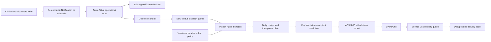

# Durable notification architecture

An ALTER-created dispatch message contains only a schema version, work type,
immutable notification or schedule ID, and outbox generation. The Function
re-reads authoritative Table state; the dispatch queue is never trusted as a
clinical or recipient data source. Microsoft-generated ACS delivery events are
different: Event Grid includes the destination number, so the secured delivery
queue and its DLQ must be treated as recipient data and cleaned explicitly as
described in `ACS_SMS_OPERATIONS.md`.

The active rollout policy is a separate strongly consistent Azure Table point
record. It versions the publication switch, activation watermark, case
allowlist, and daily limit. App Settings restart and configure the processes,
but they are not trusted as a live in-flight revocation channel. The dispatcher
point-reads the durable record immediately before transport submission and
atomically cancels unsent work when its authorizing version is no longer active.

The existing 210-minute overdue-vitals rule is unchanged. A current clock writes
a versioned scheduled message. A newer vital reading replaces the ledger
version and publication generation, so an older message cannot consume or mark
the replacement. Closing, transferring, or completing a case cancels unsent
work and dispatch revalidates immediately before ACS. Acknowledging an
already-created, still-current alert hides the in-app record but deliberately
does not cancel its one required SMS.
